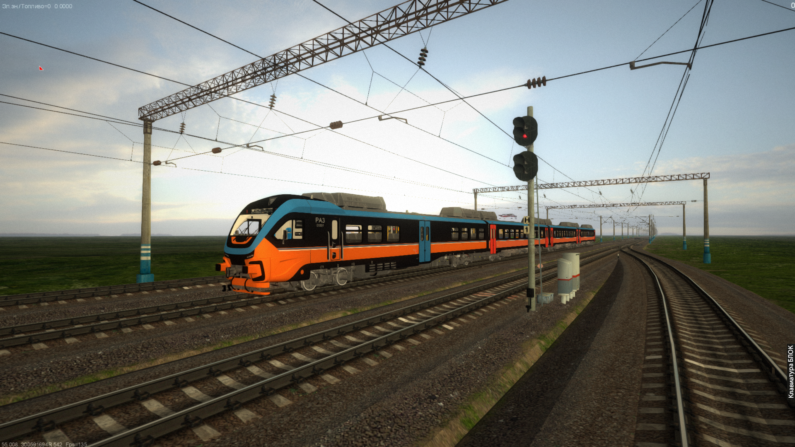

<div align="center">



<br/>

# ZDS-Booster

**Кинематографичный движок и расширения для [ZDSimulator](https://zdsimulator.com/)**

<br/>

[](LICENSE)
[](https://www.embarcadero.com/)
[](https://github.com/raildriver1/zds-booster)
[](#требования)
[](https://github.com/raildriver1/zds-booster/releases)

<br/>

[**О проекте**](#-о-проекте) • [**Возможности**](#-возможности) • [**Установка**](#️-установка) • [**Управление**](#-управление) • [**Конфиги**](#-конфигурация) • [**Поддержка**](#-поддержка)

</div>

---

## 📖 О проекте

**ZDS-Booster** — модифицированный `DGLEngine.dll` для **ZDSimulator**, который добавляет в симулятор современный графический pipeline, свободную камеру, расширенную информацию в кабине, систему АЛС-ЕН и кучу других возможностей. Никаких внешних зависимостей — просто заменяешь DLL и сразу получаешь всё.

> 🔗 Базовый, не модифицированный движок (для сравнения и backup): [maisvendoo/DGLEngine](https://github.com/maisvendoo/DGLEngine)

<br/>

## ✨ Возможности

<table>
<tr>
<td width="50%" valign="top">

### 🎬 Cinematic PostFX render-graph

Современный конвейер пост-эффектов поверх рендера ZDSimulator. Все эффекты переключаются **на лету** из меню `F12` без рестарта.

**Tier 1 — цветовой пост:**
- 🌟 **HDR Bloom** — мульти-мип pyramid (6 уровней) с soft-knee curve
- 🎞️ **ACES Filmic Tone Mapping** — киношная кривая, экспозиция настраивается
- 🔪 **CAS Sharpening** — резкость без halo (AMD FidelityFX)
- 🎥 **Vignette + Film Grain + Dithering**
- 🌈 **Хроматическая аберрация** (опционально)
- 🔲 **FXAA 3.11** — edge-aware антиалиасинг

**Tier 2 — depth-aware:**
- 🕳️ **SSAO** — объёмные тени в кабине
- 🌫️ **Атмосферная дымка** — depth-based fog
- 🎯 **Depth of Field** — bokeh-blur с фокусом

</td>
<td width="50%" valign="top">

### 🎥 Свободная камера (Freecam)
- Тоггл: <kbd>Alt</kbd>+<kbd>X</kbd>
- Полное управление: <kbd>W</kbd> <kbd>A</kbd> <kbd>S</kbd> <kbd>D</kbd> <kbd>Space</kbd> <kbd>Shift</kbd>
- Настраиваемые скорости (base / fast / turn)
- World-anchor режим: <kbd>Alt</kbd>+<kbd>Shift</kbd>+<kbd>X</kbd> — камера остаётся в мировой точке когда поезд едет

### 📊 Расширенная кабина (только ЧС7)
- УСАВПП: время / дата / координаты / давление / ускорение
- САУТ: цифровые скорость и лимиты
- Ступени тяги (Уровень ступени)

### 🚦 Система АЛС-ЕН (только ЧС7)
- Активация: <kbd>1</kbd><kbd>3</kbd><kbd>7</kbd> → <kbd>Enter</kbd> → частота → <kbd>Enter</kbd>
- Двойная индикация: КЛУБ + БИЛ ПОМЕ
- Автоматический анализ последовательности сигналов

### 🌅 Карусель неба
- Авто-смена день/ночь по игровому времени
- Поддержка зимы/лета с раздельными интервалами

</td>
</tr>
</table>

<br/>

## 🛠️ Установка

```bash
# 1. Резервная копия оригинального DLL
copy DGLEngine.dll DGLEngine_backup.dll

# 2. Замени DGLEngine.dll на бустер-версию
# 3. Запусти игру — zdbooster.cfg создастся автоматически
```

> 💡 Все настройки в `zdbooster.cfg` сохраняются автоматически из меню `F12`. Файл можно редактировать руками для тонкого тюнинга.

<br/>

## 🎮 Управление

### Глобальные хоткеи

| Действие | Хоткей |
|---|---|
| Открыть/закрыть меню | <kbd>F12</kbd> |
| Включить / выключить фрикам | <kbd>Alt</kbd>+<kbd>X</kbd> |
| World-anchor для фрикама | <kbd>Alt</kbd>+<kbd>Shift</kbd>+<kbd>X</kbd> |
| АЛС-ЕН (только ЧС7) | <kbd>1</kbd><kbd>3</kbd><kbd>7</kbd> + <kbd>Enter</kbd> |

### В режиме фрикама

| Действие | Клавиша |
|---|---|
| Движение | <kbd>W</kbd> <kbd>A</kbd> <kbd>S</kbd> <kbd>D</kbd> |
| Подъём / спуск | <kbd>Space</kbd> / <kbd>Ctrl</kbd> |
| Ускорение (×N) | <kbd>Shift</kbd> |
| Поворот камеры | мышь |

### Гизмо для редактирования 3D-текстов / картинок (RA-3 кабина)

| Режим | Что делает |
|---|---|
| **T** (translate) | стрелки X/Y/Z для перемещения |
| **R** (rotate) | кольца для вращения по осям |
| **S** (scale) | кубики для масштабирования |
| <kbd>Shift</kbd> при drag | snap к шагу (5мм / 5° / 0.05×) |
| <kbd>Ctrl</kbd> при drag | precision mode (×0.2) |
| <kbd>Esc</kbd> при drag | отмена и откат к началу drag'а |

<br/>

## 📁 Структура файлов

```
ZDSimulator/
├── DGLEngine.dll              # ← Бустер
├── zdbooster.cfg              # Главный конфиг (autosave из F12)
│
├── data/<тип_лок>/<номер>/
│   ├── loc/                   # Кастомные модели
│   │   ├── kolpara_*.dmd
│   │   ├── klub_ls_*.dmd      # АЛС-ЕН блоки
│   │   ├── strelka_skor.dmd
│   │   └── pisec*.dmd
│   └── raildriver/
│       ├── booster.txt        # Тоггл-флаги (только ЧС7)
│       ├── custom_texts.cfg   # 3D-тексты в кабине (per-loco)
│       └── custom_images.cfg  # 3D-картинки в кабине (per-loco)
│
└── routes/<маршрут>/
    ├── textures/
    │   ├── sky_sunriseDawn.bmp        # Предрассветные сумерки
    │   ├── sky_sunsetTwilight.bmp     # Закатные сумерки
    │   ├── sky_sunriseDawn_snow.bmp   # ↳ зима
    │   └── sky_sunsetTwilight_snow.bmp
    └── models/
        └── sky.dmd            # Расширенная сфера неба (для дальности)
```

<br/>

## ⚙️ Конфигурация

<details>
<summary><b>📝 <code>raildriver/booster.txt</code> — отображение элементов в кабине ЧС7</b></summary>

```ini
saut: 0       # Отображение данных САУТ
bgsd: 1       # Отображение монитора УСАВПП
stupen: 1    # Отображение уровня ступени
```

</details>

<details>
<summary><b>🎬 <code>zdbooster.cfg</code> — PostFX render-graph (autosave)</b></summary>

```ini
# Master
postfx: 1     # 0/1 — весь PostFX-chain (если 0 → fallback на старый Bloom + FXAA)

# Tier 1 — цвет
fxaa: 1       # FXAA 3.11
bloom: 1      # HDR Bloom
tonemap: 1    # ACES Filmic
sharpen: 1    # CAS sharpening
vignette: 1   # виньетирование
grain: 1      # film grain

# Tier 2 — depth-aware
ssao: 1       # SSAO (требует depth)
fog: 0        # атмосферная дымка
dof: 0        # depth of field
```

Каждый toggle живой — переключаешь и сразу видишь результат. Master-toggle `postfx: 0` отрубает весь chain и возвращает старый Bloom + FXAA fallback.

</details>

<details>
<summary><b>📍 <code>custom_texts.cfg</code> / <code>custom_images.cfg</code> — пользовательские 3D-объекты в кабине (per-loco)</b></summary>

Любой текст из KLUB-данных (скорость / давление / координаты / время / лимиты) или произвольную BMP/JPG/TGA картинку можно разместить **3D в кабине** через DevEditor (`F12` → Locomotive → «Open Full Dev Editor»).

Редактор поддерживает:
- gizmo translate / rotate / scale
- ввод чисел руками в ячейки
- per-loco сохранение (своя конфигурация для каждого `<тип_лок>/<номер>`)
- magenta-key прозрачность ($FF00FF) для картинок

</details>

> ⚠️ **Важно**: Расширенная информация в кабине и АЛС-ЕН (HookKLUB) работают **только на ЧС7** (тип 822). Все остальные функции (фрикам, PostFX, новое небо, кастомные 3D-объекты, гизмо) работают **на всех локомотивах**.

<br/>

## 🐛 Диагностика

Все сообщения движка пишутся в `DGLEngine_Log.txt` рядом с игрой.

<details>
<summary><b>HookKLUB не работает</b></summary>

В логе должно быть:
```
Hook activated for locomotive type 822 (CS7)
```
Если нет — используется не ЧС7, или айди локомотива не 822.

</details>

<details>
<summary><b>Фрикам не активируется</b></summary>

В `zdbooster.cfg`:
```ini
freecam: 1
```
В логе:
```
Freecam initialized for locomotive type ...
```

</details>

<details>
<summary><b>Не загружаются кастомные модели</b></summary>

Проверь структуру:
```
data/chs7/<номер>/loc/
```
В логе должно быть:
```
Модель <название> загружена, ID: <число>
```

</details>

<details>
<summary><b>Не меняются текстуры карусели неба</b></summary>

Должны лежать в `routes/<маршрут>/textures/`:
- `sky_sunriseDawn.bmp`
- `sky_sunsetTwilight.bmp`
- `sky_sunriseDawn_snow.bmp` (зима)
- `sky_sunsetTwilight_snow.bmp` (зима)

И в `zdbooster.cfg`:
```ini
newsky: 1
```

</details>

<br/>

## 🔧 Техническая информация

### Стек

- **IDE:** CodeGear Delphi 2007 (`dcc32.exe`)
- **Язык:** Object Pascal
- **API:** OpenGL 1.x + GLSL для PostFX-шейдеров
- **Целевая платформа:** Windows 10 / 11 (x86)

### Методы патчинга

| Техника | Назначение |
|---|---|
| **`VirtualProtect` + Move** | Изменение байтов в `.text` секции `Launcher.exe` |
| **Перехват CALL** | Переписывание `E8` rel32 на адрес собственной функции в DLL |
| **Function pointer hooks** | Регистрация Pascal-процедур через `RegProcedure` (game callback) |
| **`FlushInstructionCache`** | Гарантия видимости новых байт CPU после patching |

### Что делает бустер с памятью игры

- Расширяет дальность видимости (`gluPerspective(zFar)` и `fcomp` distance constants)
- Подавляет сброс камеры при ЛКМ-в-центре когда мышь над кабинными элементами
- Подменяет вызов `DrawSky` на собственную карусель текстур
- Хукает `HookKLUB` (только ЧС7) для отрисовки расширенной информации
- Перехватывает `SetFog` / `SetCutingPlanes` для тюнинга визуала

> ⚠️ Все патчи делаются с `VirtualProtect(PAGE_EXECUTE_READWRITE)` и автоматически восстанавливаются если соответствующая опция отключена в меню. Для самозащиты — **обязательно делай резервную копию `DGLEngine.dll`** перед заменой.

<br/>

## 📞 Поддержка

При возникновении проблем:

1. 📋 Проверь `DGLEngine_Log.txt`
2. ⚙️ Убедись что `zdbooster.cfg` содержит нужные тоггл-флаги
3. 🚂 Для ЧС7 — проверь активацию HookKLUB в логе
4. 🐛 [Создай Issue](https://github.com/raildriver1/zds-booster/issues/new) с описанием и логом
5. 💬 Или напиши в группу [VK • RailDriver](https://vk.com/raildriver) с приложенным `DGLEngine_Log.txt`

<br/>

## 📜 Лицензия

[GPL-2.0](LICENSE) — свободное ПО, любой может изучать, изменять и распространять. См. [LICENSE](LICENSE) и [LICENSE-Russian](LICENSE-Russian).

<br/>

<div align="center">

**ZDS-Booster** — для энтузиастов железнодорожного моделирования

[💜 Поддержать проект](donate.txt) • [🚂 VK RailDriver](https://vk.com/raildriver) • [🔧 Базовый DGLEngine](https://github.com/maisvendoo/DGLEngine)

<sub>HookKLUB работает только на ЧС7 • Все остальное — на всех локомотивах • Made with ☕ in Pascal</sub>

</div>
